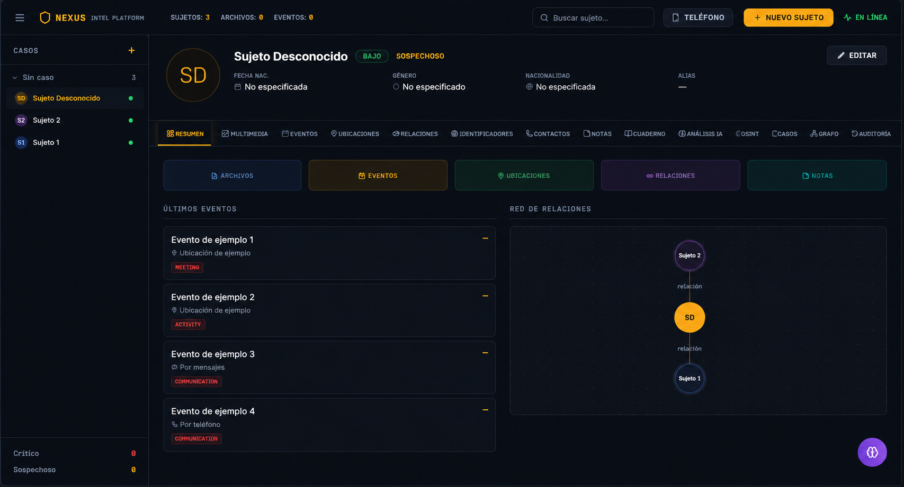
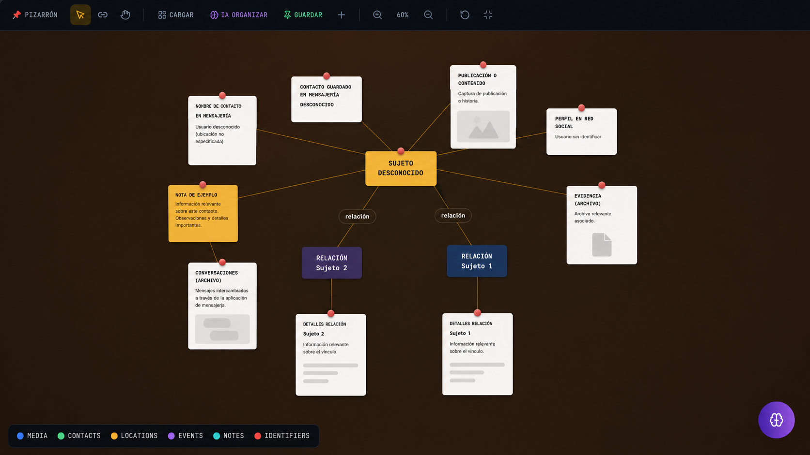
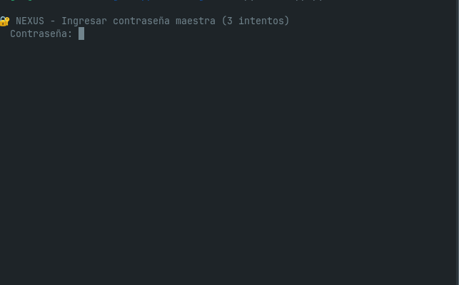

<div align="center">

# ⬡ NEXUS — Plataforma de Investigación

**OSINT Suite · Gestión de Casos · Pizarrón Visual · Análisis con IA 🔐**

[](LICENSE)
[](https://python.org)
[](https://flask.palletsprojects.com)
[](https://react.dev)
[](https://github.com/tuangel134/nexus/releases)

---

## 🚀 Una línea de comando y ya está funcionando

```bash
# Linux / macOS
curl -sSL https://raw.githubusercontent.com/tuangel134/nexus/main/install.sh | bash

# Windows (PowerShell)
iwr -useb https://raw.githubusercontent.com/tuangel134/nexus/main/install.ps1 | iex
```

---

## 📸 Capturas de Pantalla

<div align="center">

| Panel Principal | Pizarrón Interactivo | Encriptación |
|:---:|:---:|:---:|
|  |  |  |

</div>

---

## 🔥 ¿Qué hace NEXUS?

NEXUS es una **plataforma integral de investigación** que combina herramientas OSINT automatizadas, gestión de evidencia visual, análisis asistido por inteligencia artificial y encriptación de datos — todo en una aplicación autónoma que corre en tu máquina, sin depender de servidores externos.

### 🕵️ Investigación OSINT Automatizada
- Escaneo de **500+ plataformas** en paralelo con detección inteligente de tipo de dato
- **Maigret**, **Socialscan**, **Holehe**, **Ignorant**, **Toutatis** integrados y auto-instalables
- Búsqueda por **username**, **email**, **teléfono** o **nombre completo**
- Filtro de falsos positivos con IA integrada

### 📌 Pizarrón de Investigación (Visual Board)
- Tablero tipo **corkboard** con nodos, conexiones, notas adhesivas y fotos polaroid
- Arrastrá elementos, conectalos con hilos, organizalos a tu manera
- **Pantalla completa** con herramientas visibles
- Guardado automático en el navegador
- Botón **IA Organizar** que conecta automáticamente la evidencia relacionada

### 🤖 Análisis con Inteligencia Artificial
- **Perfil Psicológico** completo del sujeto
- **Evaluación de Riesgo** con matriz de probabilidad e impacto
- **Patrones de Comportamiento** con detección de anomalías
- **Análisis de Red** basado en el pizarrón y las relaciones
- **Resumen Ejecutivo** profesional del caso
- Compatible con **OpenAI**, **Anthropic Claude**, **DeepSeek**, **NVIDIA** y cualquier API compatible

### 📋 Gestión de Casos y Expedientes
- Sujetos con perfiles completos, foto, alias, nivel de riesgo
- **Casos** que agrupan sujetos con detective asignado y número de expediente
- **Eventos** con línea de tiempo interactiva (vista lista + timeline visual)
- **Ubicaciones** con coordenadas GPS y enlace a Google Maps
- **Relaciones** entre sujetos con tipos y fuerza de vínculo
- **Identificadores**: CURP, RFC, pasaporte, INE, emails, teléfonos, IPs
- **Contactos**: redes sociales, mensajería, email
- **Grafo** de red entre todos los sujetos del sistema

### 📓 Cuaderno del Investigador
- Notas personales que **NO se envían a la IA**
- Hipotésis, preguntas, teorías, observaciones privadas
- Separado de las notas de investigación

### 🔐 Seguridad y Encriptación
- Todos los datos encriptados en reposo con **AES-256-GCM**
- Derivación de clave con **PBKDF2** (600,000 iteraciones)
- Backups **auto-contenidos** con cabecera de versión (compatibilidad futura)
- **Recovery Package (.nrb)**: respaldo completo portátil
- Auto-encriptado al cerrar la aplicación
- Contraseña maestra requerida para acceder

### 📱 Subida desde el Teléfono
- Código QR con la IP local
- Interfaz mobile-friendly optimizada
- Selección de sujeto y subida directa a Multimedia

### 📜 Auditoría Completa
- Registro de todas las acciones: crear, editar, eliminar
- Útil para investigación forense del propio caso y coordinación en equipo

---

## 🏗️ Arquitectura

```
nexus/
├── app.py                          # 🐍 Backend Flask (API REST)
├── crypto.py                       # 🔐 Encriptación AES-256-GCM + PBKDF2
├── nexus.sh                        # 🚀 Script de inicio
├── nexus-frontend/app/             # ⚛️ Frontend React 19 + Vite + Tailwind
│   └── src/
│       ├── components/layout/      # TopBar, Sidebar, TabNavigation, AIAssistant
│       └── components/sections/    # EventsSection, BoardSection, OSINTSection...
├── script investigacion/           # 🕵️ Motor OSINT (sherlock++ 500+ plataformas)
│   └── sherlock_ultimate.py        # Maigret, Socialscan, Holehe, Ignorant...
├── screenshots/                    # 📸 Capturas de pantalla
└── uploads/                        # 📁 Archivos multimedia
```

---

## 🛠️ Tecnologías

| Capa | Tecnología |
|------|-----------|
| **Backend** | Python 3 + Flask + SQLite |
| **Frontend** | React 19 + TypeScript + Vite + Tailwind CSS |
| **Animaciones** | Framer Motion |
| **UI Components** | shadcn/ui + Lucide Icons |
| **OSINT** | Sherlock++, Maigret, Socialscan, Holehe, Ignorant, Toutatis |
| **Encriptación** | AES-256-GCM + PBKDF2 (cryptography) |
| **Build** | PyInstaller (.exe) · dpkg-deb (.deb) · GitHub Actions |

---

## ⚡ Inicio Rápido

```bash
# 1. Instalación (un solo comando)
curl -sSL https://raw.githubusercontent.com/tuangel134/nexus/main/install.sh | bash

# 2. Iniciar
cd nexus && python3 app.py

# 3. Abrir navegador en http://localhost:7331
```

En la primera ejecución, NEXUS te pedirá configurar una **contraseña maestra** para encriptar todos los datos. A partir de ahí, cada vez que inicies la aplicación deberás ingresarla para desencriptar y acceder a tu información.

---

## 📦 Descargas

| Plataforma | Archivo |
|-----------|---------|
| 🪟 Windows | `nexus.exe` (descargar de [Releases](https://github.com/tuangel134/nexus/releases)) |
| 🐧 Linux | `nexus-*.deb` (descargar de [Releases](https://github.com/tuangel134/nexus/releases)) |
| 🐍 Python | `pip install -r requirements.txt` |

---

## 🤝 Contribuciones

¿Encontraste un bug? ¿Tenés una idea para mejorar NEXUS? 
Abrí un [issue](https://github.com/tuangel134/nexus/issues) o enviá un [pull request](https://github.com/tuangel134/nexus/pulls).

---

## ☕ Apoya el Proyecto

Si NEXUS te es útil, considerá hacer una donación:

**PayPal:** [https://paypal.me/tuangel1346](https://paypal.me/tuangel1346) — tuangel1346@gmail.com

**Criptomonedas (Bitcoin):**

```
bc1q5nrv64jchep3hpqptvwmume8rkw68937zftfpa
```

---

<div align="center">
  <sub>Hecho con ❤️ para la comunidad de investigación e inteligencia.</sub>
  <br>
  <sub>⭐ Dejá una estrella en GitHub si te sirve</sub>
  <br>
  <sub>© 2026 — MIT License</sub>
</div>
